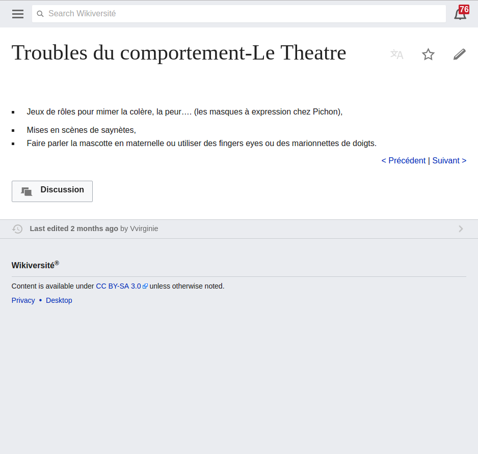
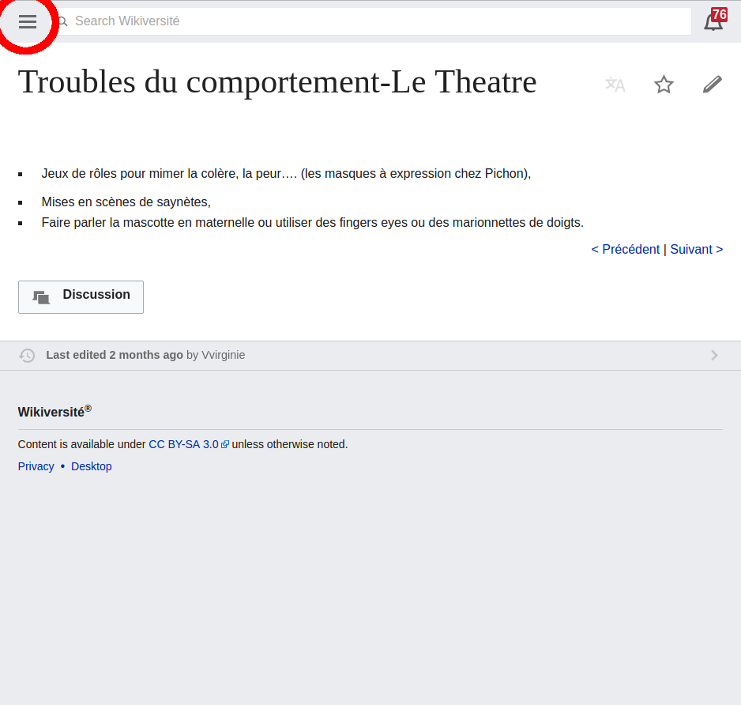
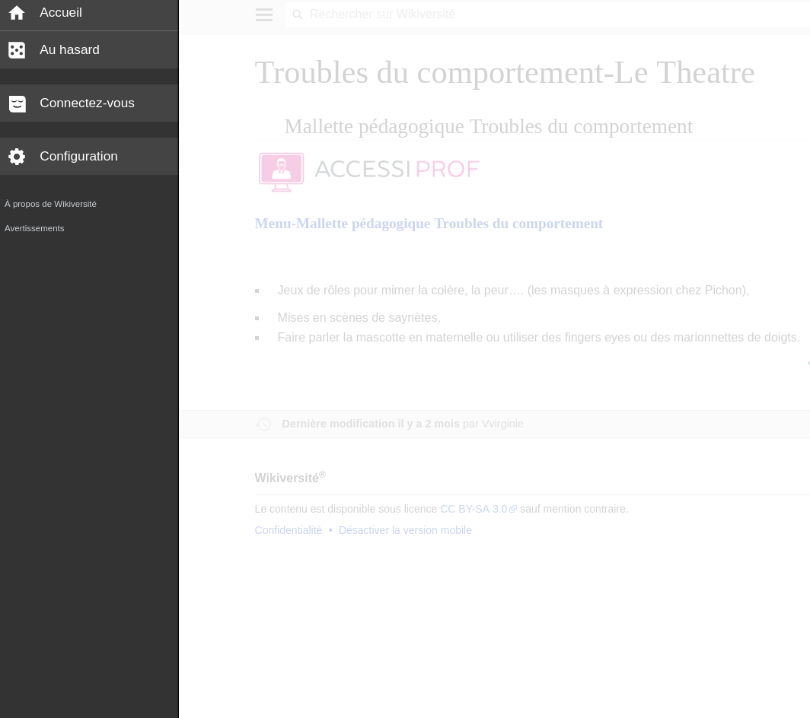

# 1. Introduction

Le template est chargé avec un gadget par défaut pour tous les utilisateurs de la Wikiversité. Il est composé de deux fichiers : `Gadget-MOOC.css` et `Gadget-MOOC.js`.

Un code HTML permet de l'activer pour une page, il est optionnel et au choix du contributeur.

jQuery est requis.

Le contenu du menu est stocké sur une page externe. Il est chargé et affiché dynamiquement.

Le CSS est responsive et le JavaScript est optimisé pour mobile.

La version actuelle de MediaWiki sur la Wikiversité est : `1.29.0-wmf.3`.

# 2. Problème

## Apercu sous mobile

\ 

Les fichiers CSS et JavaScript du gadget ne sont pas chargés.

# 3. Etude des solutions évoquées

## 3.1 Modifier la manière d'inclusion des scripts

Voir 3.7.

## 3.2 Contribution au projet open-source MediaWiki

MediaWiki possède un support pour les devices mobiles.

Supposition érronée ; __solution abandonnée__.

## 3.3 Gadget destiné aux mobiles

Par défaut un gadget est configuré pour être affiché sous desktop.

Configuration du ciblage :

| Name      | Parameters    | Description  | Since |
|-----------|---------------|--------------|-------|
| `targets` | `desktop` (default), `mobile` or `desktop,mobile` | Set the RL target(s) for the gadget. | ?

Source : https://www.mediawiki.org/wiki/Extension:Gadgets

### 3.3.1 Test

Solution testée avec l'aide de JackPotte. Il a rencontré une erreur de _parse_ du script.
MediaWiki possède son propre parser JavaScript peu compatible.

Source : https://fr.wikiversity.org/wiki/Discussion_utilisateur:JackPotte/2016#Mod.C3.A8le_MOOC_wikiversit.C3.A9_sur_les_devices_mobiles

## 3.4 Extension serveur

L'idée est de créer un « gadget serveur ». Nous avons ensuite la possibilité d'injecter du contenu directement dans la page.

Au même titre que le contenu du contributeur, les fichiers du gadget et le mene seront présents dans la page.

En revanche, c'est un développement important et l'extension affectera la rapidité de chargement des pages.
Sans oublier le risque d'erreur serveur qui bloquera la génération de la page.

Ce n'est pas dans l'intérêt de la Wikiversité ; __solution abandonnée__.

## 3.5 Inclure le gadget « à la main »

Pour des raisons de sécurité, un contributeur ne peut pas inclure de script à l'aide d'une balise HTML `<script>`.

__Solution abandonnée__.

## 3.6 Restreindre au desktop

Un message pourrait être affiché pour notifier l'utilisateur.

Cette solution est réalisable mais à l'encontre du besoin ; __solution abandonnée__.

## 3.7 Inclusion dans les fichiers communs

Actuellement déjà en place.

Les fichiers du gadget `Gadget-MOOC` sont ajoutés à la fin du fichier `MediaWiki:Common.js`.

Source :

```javascript
importStylesheetURI("[...]");
mw.loader.load("[...]");
```

Le JavaScript est inclus avec la fonction `mw.loader.load`.

### 3.7.1 MediaWiki « Resource loader »

Le fichier CSS est actuellement inclus avec la fonction `importStylesheetURI`. A noter que cette fonction, ainsi que `importScript` sont dépréciés (source : https://phabricator.wikimedia.org/T95964).

`mw.loader.load` permet aussi d'inclure des fichiers CSS. Il sera injecté dans une balise `link` au moment du chargement de la page.

__Il ne semble pas avoir de restriction sur le chargement des fichiers.__

### 3.7.2 Fichier common mobile

Il existe un équivalent de `MediaWiki:Common.css` et `MediaWiki:Common.js` destiné exclusivement aux mobiles ; respectivement `MediaWiki:Mobile.css` et `MediaWiki:Mobile.js`.

Ces fichiers ne sont actuellement pas exploités par la Wikiversité.

Source: https://fr.wikiversity.org/w/index.php?title=MediaWiki:Mobile.css
et https://fr.wikiversity.org/w/index.php?title=MediaWiki:Mobile.js.

### 3.7.3 Test

J'ai utilisé un serveur web en local hébergant un MediaWiki (avec docker, source: https://hub.docker.com/r/bitnami/mediawiki/).

- Version de MediaWiki : `1.27.1`.
- Extensions ajoutées : MobileFrontend (source : https://www.mediawiki.org/wiki/Extension:MobileFrontend)

Le modèle MOOC est chargé depuis les deux fichiers communs :

- `MediaWiki:Common.js`.
- `MediaWiki:Mobile.js`.

Lors de mes tests je n'ai pas rencontré d'erreur de _parse_.

Dans cette configuration le modèle MOOC est bien chargé en mode mobile et desktop.

# 4. Conclusion

Il y a certaines barrières mises en place par MediaWiki pour garantir une bonne expérience sous mobile.

Cependant il semble possible d'inclure nos scripts sous mobile.

__Les deux solutions envisageables sont : 3.7.2 et 3.3__ et __le point 3.7.2 à été confirmé par mes tests (point 3.7.3).__

## 4.1 Mobile-friendly

> Note good web practice states that you should have good fallbacks for non-JavaScript users.

Dans notre cas le modèle MOOC require du JavaScript pour afficher le menu.
Un utilisateur sans JavaScript ne pourra pas naviguer dans une formation et une version dégradée sera affichée.

> There is a good reason why that we decided to turn ResourceLoader modules off by default. "We want you to think about mobile."

Cela explique le point 3.7.1.

> Using `targets` you can decide to give a completely different experience to your mobile site users.

Complète le point 3.3.

> We don't load common scripts or MediaWiki:Common.js/css as these were designed without mobile in mind.

Complète le point 3.7.

Source: https://www.mediawiki.org/wiki/ResourceLoader/Writing_a_MobileFrontend_friendly_ResourceLoader_module

## 4.2 Evolution(s)

### 4.2.1 Intégration au menu mobile

\ 

Le menu du modèle MOOC pourrait être accessible via le _hamburger_. Voir icône entourée en rouge.

\ 
