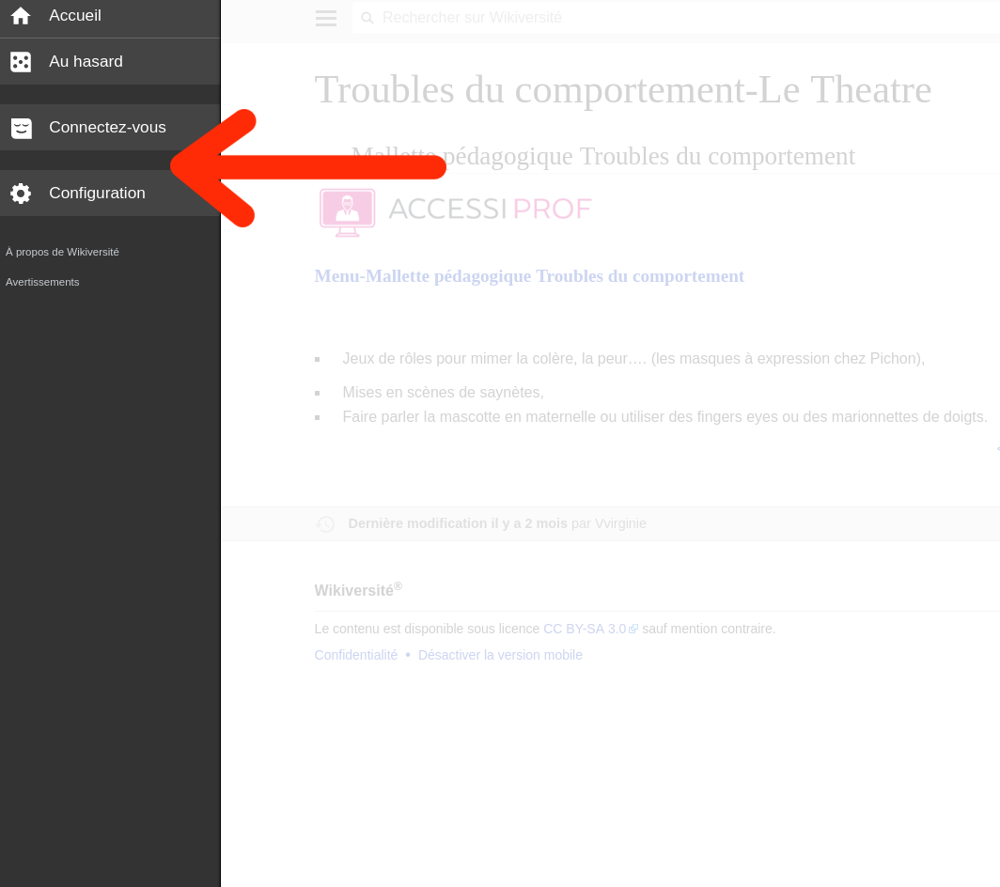

# 1. Introduction

Le template est chargé via un gadget. Il est composé de deux fichiers : `Gadget-MOOC.css` et `Gadget-MOOC.js`. Il est chargé par défaut pour tous les utilisateurs de la Wikiversité.

Un code HTML permet de l'activer pour une page, il est optionnel et au choix du contributeur.

Le gadget require JavaScript et jQuery.

Le contenu du menu est stocké sur une page externe. Il est chargé et affiché dynamiquement.

Le CSS est responsive et le JavaScript est optimisé pour mobile.

La version actuelle de MediaWiki sur la Wikiversité est : `1.12`.

# 2. Problème

## Apercu sous mobile

\ 

Les fichiers CSS et JavaScript destinés au modèle MOOC ne sont pas chargés.

# 3. Etude des solutions évoquées

## 3.1 Modifier la manière d'inclusion des scripts

Voir 3.7.

## 3.2 Contribution au projet open-source MediaWiki

MediaWiki supporte les devices mobiles.

Supposition éronnée ; __solution abondonnée__.

## 3.3 Gadget destiné aux mobiles

Par défaut un gadget est configuré pour être affiché sous desktop.

Configuration du ciblage :

| Name      | Parameters    | Description  | Since |
|-----------|---------------|--------------|-------|
| `targets` | `desktop` (default), `mobile` or `desktop,mobile` | Set the RL target(s) for the gadget. | ?

Source : https://www.mediawiki.org/wiki/Extension:Gadgets

## 3.4 Extension serveur

L'idée est de créer un « gadget serveur ». Nous avons ensuite la possiblité d'injecter du contenu directement dans la page.

Au même titre que le contenu du contributeur, les fichiers du gadget et le menu seront présent dans la page.

En revanche, c'est un développement important et l'extension affectera la rapidité de chargement des pages.
Sans oublier le risque d'erreur serveur qui bloquera la génération de la page.

Ce n'est pas dans l'intéret de la Wikiversité ; __solution abondonnée__.

## 3.5 Inclure le gadget « à la main »

Pour des raisons de sécurité, un contributeur ne peut pas inclure de script a l'aide d'une balise HTML `<script>`.

__Solution abondonnée__.

## 3.6 Restreindre au desktop

Un message pourrait etre affiché pour notifier l'utilisateur.

Un utilisateur sur mobile sera automatiquement redirigé vers la version mobile du site.
Nous ne pouvons pas empecher cette redirection.

C'est solution est réalisable mais à l'encontre du besoin ; __Solution abondonnée__.

## 3.7 Inclusion dans les fichiers communs

Actuellement déjà en place.

Les fichiers du gadget `Gadget-MOOC` sont ajoutés à la fin du fichier : `MediaWiki:Common.js`.

Source :

```javascript
importStylesheetURI("[...]");
mw.loader.load("[...]");
```

Le JavaScript est inclus avec la fonction `mw.loader.load`.

### 3.7.1 « Resource loader »

Le fichier CSS est actuellement inclus avec la fonction `importStylesheetURI`. A noter que cette fonction, ainsi que `importScript` sont dépréciées (source : https://phabricator.wikimedia.org/T95964).

`mw.loader.load` permet aussi d'inclure des fichier CSS. Il sera injecté dans une balise `link` au moment du chargement de la page.

__Le loader ne semble pas restreindre le chargement des fichiers.__

### 3.7.2 Fichiers common mobile

Il existe un équivalent de `MediaWiki:Common.css` et `MediaWiki:Common.js` destiné exlusivement aux mobiles ; respectivement `MediaWiki:Mobile.css` et `MediaWiki:Mobile.js`.

Ces fichiers ne sont actuellement pas exploité par la Wikiversité.

Source: https://fr.wikiversity.org/w/index.php?title=MediaWiki:Mobile.css
et https://fr.wikiversity.org/w/index.php?title=MediaWiki:Mobile.js.

# 4. Conclusion

Il y'a certaine barrière mise en place par MediaWiki pour garantir une bonne expérience sous mobile.

Cepandant il semble possible d'inclure nos scripts sous mobile.

Nous pouvons utiliser le meme gadget pour les deux plateformes ou séparer en deux gadget distent.

__Les deux solutions envisageables sont : 3.7.2 et 3.3.__

## 4.1 Mobile-friendly

> Note good web practice states that you should have good fallbacks for non-JavaScript users.

Dans notre cas le modèle MOOC require du JavaScript pour afficher le menu.
Un utilisateur sans JavaScript ne pourra pas naviguer dans une formation et une version dégradé sera affiché.

> There is a good reason why that we decided to turn ResourceLoader modules off by default. "We want you to think about mobile."

Cela explique le point 3.7.1.

> Using `targets` you can decide to give a completely different experience to your mobile site users.

Complete le point 3.3.

> We don't load common scripts or MediaWiki:Common.js/css as these were designed without mobile in mind.

Complete le point 3.7.

Source: https://www.mediawiki.org/wiki/ResourceLoader/Writing_a_MobileFrontend_friendly_ResourceLoader_module

## 4.2 Adapation mobile

### 4.2.1 Intégration au menu mobile

jQuery est disponible sur la version mobile.

Idéalement le menu du modèle MOOC sera accessible via le _hamburger_. Voir icone entouré en rouge.

\ 

Menu de navigation de la version mobile :

\ 

### 4.2.2 Erreur dans le menu

Le modèle a certains messages internes d'avertissement quand un composant rencontre une anomalie.

J'ai observé sur la version mobile le message : `Page introuvable dans le menu`, qui indique que la page actuelle n'apparaît pas dans le menu.

Pourtant la page est bien dans le menu. J'ai l'impression que c'est le fait d'etre sur le domaine mobile (https://fr.m.wikiversity.org). Un légé développement est à prévoir.

